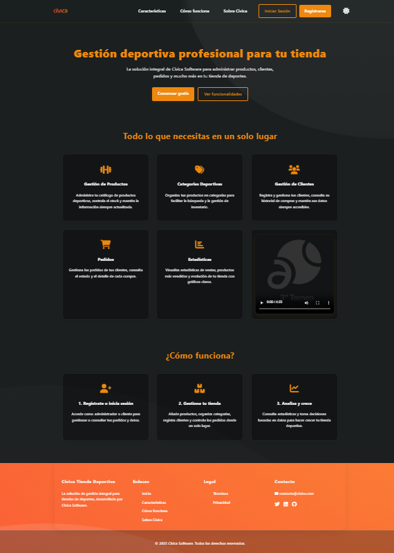
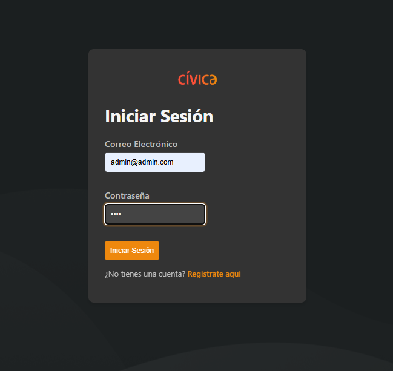
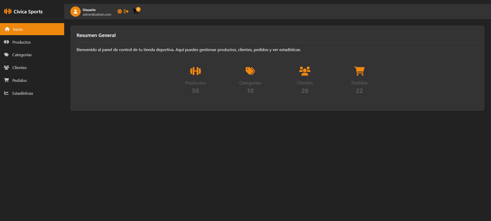
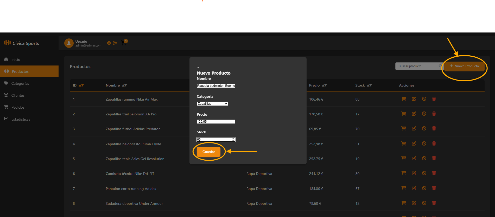
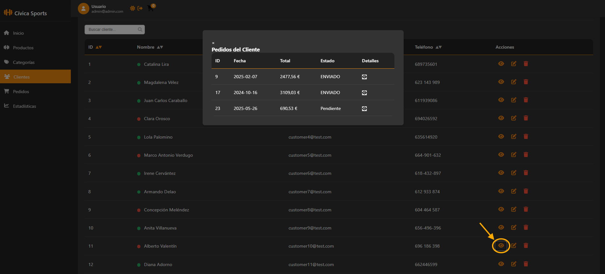
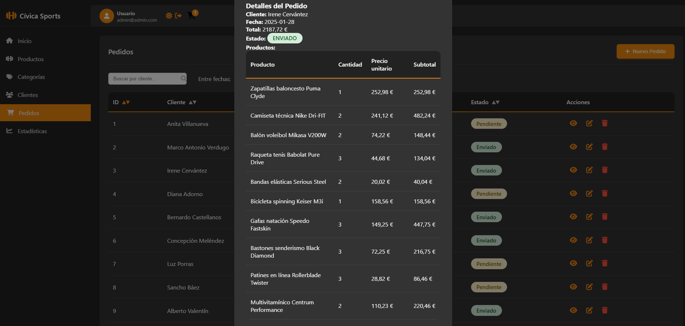
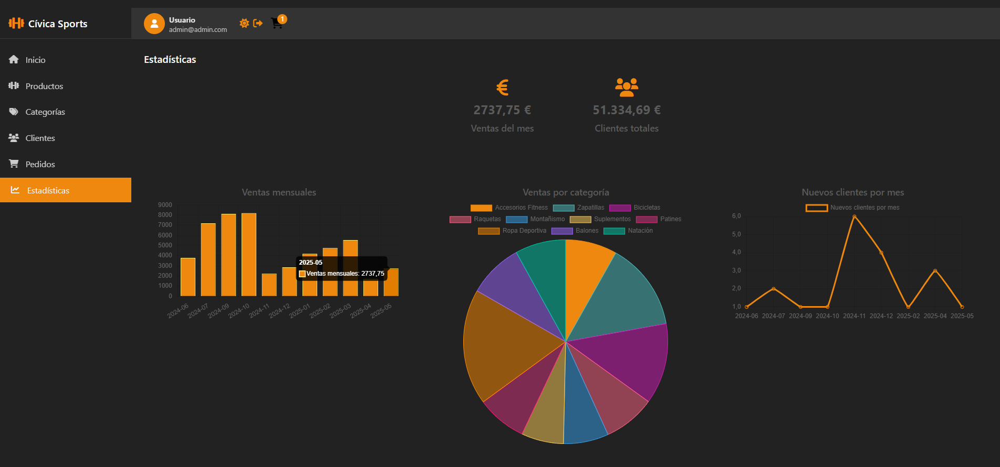
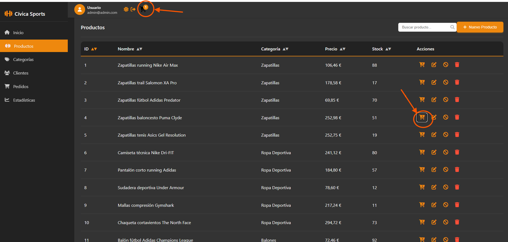

<div align="center">
  
</div>

# Cívica Sports - User Guide

## Table of Contents
1. [Introduction](#introduction)
2. [Getting Started](#getting-started)
   - [System Requirements](#system-requirements)
   - [Installation](#installation)
   - [First Login](#first-login)
3. [User Roles & Permissions](#user-roles--permissions)
4. [Core Features](#core-features)
   - [Dashboard](#dashboard)
   - [Product Management](#product-management)
   - [Category Management](#category-management)
   - [Customer Management](#customer-management)
   - [Order Processing](#order-processing)
5. [Advanced Features](#advanced-features)
   - [Statistics & Reports](#statistics--reports)
   - [Shopping Cart](#shopping-cart)
   - [Theme Customization](#theme-customization)
6. [Troubleshooting](#troubleshooting)
7. [FAQs](#faqs)
8. [Support](#support)

---

## Introduction
Welcome to the Cívica Sports User Guide! This document provides comprehensive instructions for using our online sports store management system. Whether you're an administrator or customer, this guide will help you navigate and utilize all features effectively.

**Key Benefits:**
- Complete inventory control
- Customer relationship management
- Order processing and tracking
- Real-time analytics
- Role-based access control



---

## Getting Started

### System Requirements
| Component       | Minimum | Recommended |
|----------------|---------|-------------|
| Web Browser    | Chrome 90+, Firefox 85+ | Latest version |
| Screen Resolution | 1280×720 | 1920×1080 |
| Internet Connection | 5 Mbps | 10+ Mbps |

### Installation
No installation required for end-users. Access the system via:
```
http://your-server-address:8080
```

### First Login
1. Navigate to the login page
2. Use default credentials:
   - **Admin**: admin@admin.com / 1234
   - **Customer**: customer0@test.com / 1234
3. Change your password immediately after first login



---

## User Roles & Permissions

### Administrator
- Full access to all features
- Can manage users, products, categories
- Access to all statistics
- Can process all orders

### Customer
- View product catalog
- Place and track orders
- View personal order history
- Limited statistics access

---

## Core Features

### Dashboard
The dashboard provides an overview of key metrics:
- Total products
- Active categories
- Customer count
- Recent orders



### Product Management
**Key Actions:**
- Add/edit products
- Set prices and stock levels
- Organize by categories
- Activate/deactivate items

**Workflow:**
1. Navigate to Products
2. Click "Add Product"
3. Fill in details (name, price, stock, category)
4. Save



### Category Management
- Create and organize product categories
- Edit existing categories
- Delete unused categories (if no products are assigned)

### Customer Management
- View customer list
- Edit customer details
- Track customer orders
- Activate/deactivate accounts



### Order Processing
- Create new orders
- Update order status (Pending → Shipped → Completed)
- View order details
- Process returns



---

## Advanced Features

### Statistics & Reports
Access valuable insights through:
- Monthly sales charts
- Category performance
- Customer purchase history



### Shopping Cart
1. Browse products
2. Click "Add to Cart"
3. Specify quantity
4. Proceed to checkout
5. Confirm order



### Theme Customization
Toggle between light/dark mode using the theme switcher in the top navigation.

---

## Troubleshooting

| Issue | Solution |
|-------|----------|
| Can't login | Reset password or contact admin |
| Missing features | Check your user role permissions |
| Slow performance | Clear browser cache or try different browser |
| Data not loading | Check internet connection and refresh |

---

## FAQs

**Q: How do I reset my password?**  
A: Contact your system administrator for password resets.

**Q: Can I export order data?**  
A: Yes, use the "Export" button in the Orders section (Admin only).

**Q: Why can't I delete a category?**  
A: Categories with assigned products cannot be deleted. First reassign or delete the products.

---

## Support
For additional assistance:
- 📧 Email: support@civicasports.com
- 🌐 Help Center: [https://civicasports.com/support](https://civicasports.com/support)
- 📞 Phone: +34 123 456 789

Office Hours: Monday-Friday, 7:00-15:00 CET

---
<div align="center">
  
  <p>© 2025 Cívica Software. All rights reserved.</p>
</div>

